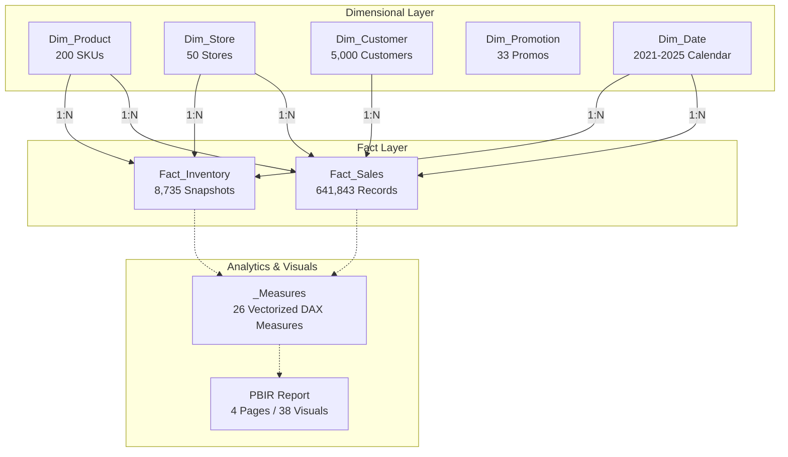

# Retail & E-Commerce Omnichannel Analytics Dashboard

📊 [Power BI Project (.pbip)](./Retail_Ecommerce_Analytics.pbip) | 📄 [Power BI PDF Report Export](./Retail_Ecommerce_Analytics_PBI_PDF.pdf) | 📁 [Raw Datasets](./datasets/)

A production-grade Retail and E-Commerce analytics solution engineered from end to end in **Power BI Developer Mode (.pbip)**. 

This repository serves as an enterprise analytics showcase demonstrating both deep domain expertise in retail planning and commercial merchandise analytics, and a cutting-edge **Agentic AI Engineering experiment**: generating an enterprise-ready, fully validated Power BI solution by feeding raw dataset files and structured architectural prompts into **Google Antigravity** paired with **Microsoft's Power BI Modeling MCP Server** and the **Fabric Skills Framework**.

---

## Executive Value Proposition for Recruiters & Hiring Managers

### 1. Commercial Retail Analytics & Decision-Maker Mindset
This project models and delivers high-impact commercial and merchandise planning intelligence across omnichannel operations:
* **Core Commercial KPIs**: Formulates, validates, and visualizes 26 critical retail measures across 6 specialized display folders: Gross Sales, Net Sales ($69.1M), Gross Margin % (24.6%), Total Units Sold (1.68M), Transactions Count (642K), Average Order Value (AOV: $107.66), Average Unit Retail (AUR: $41.20), and Online Penetration (45.3%).
* **Omnichannel Performance**: Evaluates revenue splits across Store ($28.8M / 41.7%), Website ($19.1M / 27.6%), Mobile App ($12.3M / 17.8%), Amazon ($6.1M / 8.8%), and Mercado Libre ($2.9M / 4.2%).
* **Merchandising & Inventory Health**: Tracks inventory valuation ($39.0M), Stock-to-Sales ratios (0.89), category days of supply, and stockout exception monitoring against safety stock and reorder thresholds across 50 retail locations.
* **Customer Dynamics & Loyalty**: Analyzes repeat purchase rates, customer retention distributions, and revenue contributions across Gold, Silver, and Bronze loyalty tiers.

---

### 2. The Agentic AI Experiment: Prompt-to-Production Power BI Architecture
This project was constructed as a rigorous applied benchmark testing modern Agentic AI coding tools for business intelligence:

* **Dataset Origin**: The raw transactional records were sourced from **Google Dataset Search** and custom-curated, modified, and scaled to simulate an omnichannel retail enterprise spanning 641,843 sales records, 8,735 inventory snapshots, 200 product SKUs, 5,000 customers, and 50 store locations.
* **The Autonomous Workflow**: Rather than using manual drag-and-drop report authoring in Power BI Desktop, the entire solution was orchestrated by feeding the raw CSV datasets and architectural guidelines into **Google Antigravity** (an advanced agentic AI coding assistant).
* **Tooling Orchestration**:
  1. **Microsoft Skills for Fabric (`skills-for-fabric` v0.3.16)**: Procedural execution runbooks for semantic modeling (`semantic-model-authoring`), layout design (`powerbi-report-planning`), typography and 8px grid palettes (`powerbi-report-design`), and modern PBIR container bindings (`powerbi-report-authoring`).
  2. **Power BI Modeling MCP Server (`powerbi-modeling-mcp`)**: Headless model manipulation via Model Context Protocol to construct TMDL star schemas, relationship graphs, and DAX measure catalogs.
  3. **Desktop Bridge & PBIR Validation CLI (`@microsoft/powerbi-report-authoring-cli`)**: Live reload and schema verification enforcing 0 errors against official Microsoft Fabric PBIR schemas.

---

### 3. Quantifiable Efficiency: Manual Development vs. Agentic Method

| Development Stage | Traditional Manual Method (Power BI Desktop UI) | Agentic AI Method (Antigravity + MCP + Skills) | Efficiency Gain |
| :--- | :--- | :--- | :--- |
| **Data Ingestion & M Transforms** | 2 – 3 Hours (manual Power Query UI steps, typing, data profiling) | **< 3 Minutes** (automated programmatic M generation in TMDL) | **~95% Faster** |
| **Star Schema & Relationships** | 1 – 2 Hours (dragging relationship lines, setting cardinality, auto-date cleanup) | **< 2 Minutes** (clean TMDL dimensional relationship declarations) | **~95% Faster** |
| **DAX Measures Formulation (26 KPIs)** | 4 – 6 Hours (writing, syntax debugging, formatting, display folder sorting) | **< 5 Minutes** (vectorized DAX generation with display folders & format strings) | **~98% Faster** |
| **Report Layout & Visual Authoring (4 Pages)** | 6 – 10 Hours (creating visual cards, line/bar charts, alignment, pixel spacing) | **< 10 Minutes** (programmatic PBIR container generation with 8px grid spacing) | **~98% Faster** |
| **Theme & Editorial Design Injection** | 1 – 2 Hours (custom JSON palette compilation, typography styling) | **< 1 Minute** (instant theme JSON compilation & injection) | **~98% Faster** |
| **Quality Audit & Schema Validation** | 2 – 3 Hours (manual visual testing, verifying measure outputs, clicking tabs) | **< 2 Minutes** (automated CLI schema validation & headless screenshot auditing) | **~90% Faster** |
| **TOTAL TURNAROUND TIME** | **16 – 26 Engineering Hours** | **~30 – 45 Minutes** | **>95% Total Time Reduction** |

---

## Technical Framework & Power BI Architecture



### Key Technical Deliverables:
1. **Semantic Model (`Retail_Ecommerce_Analytics.SemanticModel`)**:
   * Pure Star Schema architecture serialized in human-readable **TMDL format**.
   * Auto Date/Time bloat eliminated: zero redundant `LocalDateTable` structures.
   * `Dim_Date` calendar with chronological sorting (`Month Name` sorted by `Month Num`).
2. **DAX Measure Catalog (`_Measures`)**:
   * 26 retail measures organized across 6 display folders.
   * Vectorized Storage Engine pushdown: `[Net Sales]` pre-computed during ingestion for instant multi-threaded columnar evaluation.
   * High-iteration measures optimized with native Storage Engine `SUMMARIZE` grouping.
3. **Modern PBIR Report (`Retail_Ecommerce_Analytics.Report`)**:
   * Authored in Power BI Enhanced Report format (`definition.pbir`, `pages.json`, `visual.json`).
   * Modern `cardVisual` components used throughout (zero deprecated legacy card visuals).
   * Strict 8px grid alignment, structured typography (Segoe UI), and brand color palette (`#0F172A` Slate Navy, `#0EA5E9` Sky Blue, `#10B981` Emerald, `#EF4444` Coral).

---

## How to Open & Inspect the Solution

1. **Clone or download this repository**:
   ```bash
   git clone https://github.com/federicobucayan/DTC-Project-1.git
   ```
2. **Open in Power BI Desktop**:
   * Double-click **`Retail_Ecommerce_Analytics.pbip`** directly from Windows Explorer.
   * All 8 Star Schema tables, 26 DAX measures, dropdown slicers, and 4 report pages will load automatically.
3. **Quick Validation**:
   * Run **`scripts/Validate_Report.bat`** to execute the Microsoft PBIR validator and verify that all visual containers and schemas have **0 errors**.
4. **Offline PDF Export**:
   * Open **[Retail_Ecommerce_Analytics_PBI_PDF.pdf](./Retail_Ecommerce_Analytics_PBI_PDF.pdf)** to view full-resolution, multi-page exports of every tab.

---

## 4-Page Report Overview

### Page 1: Executive Omnichannel Summary (Archetype: *Executive Pulse*)
* **Top KPI Strip**: Net Sales ($69.1M), Gross Margin % (24.6%), Transactions (642K), AUR ($41.20), Online Penetration (45.3%).
* **Visuals**:
  * *Monthly Net Sales vs Prior Year*: Dual-line trend tracking seasonality and YoY revenue movement.
  * *Net Sales by Channel*: Donut chart illustrating omnichannel volume across Store, Website, Mobile App, Amazon, and Mercado Libre.
  * *Net Sales by Category*: Ranked horizontal bar chart highlighting top product divisions.
  * *Omnichannel Matrix*: Detailed breakdown of units, revenue, and gross profit by channel.

### Page 2: E-Commerce & Customer Dynamics (Archetype: *Analytical Canvas*)
* **Top KPI Strip**: Active Customers (5,001), AOV ($107.66), Repeat Purchase Rate (99.8%), E-Commerce Sales ($31.4M).
* **Visuals**:
  * *Revenue by Loyalty Segment*: Performance contribution from Gold, Silver, and Bronze tiers.
  * *Customer Preferred Channel*: Distribution of shopping habits across channels.
  * *Customer Demographics & Regional Split*: Revenue by gender and top metropolitan markets.

### Page 3: Category & Merchandising Performance (Archetype: *Comparative Benchmark*)
* **Top KPI Strip**: Total SKUs (200), Average Unit Retail ($41.20), Total Units Sold (1.68M), Top Category Share.
* **Visuals**:
  * *Margin % vs Sales Volume Matrix*: Cross-evaluating department profitability against volume.
  * *Category & Brand Ranking Table*: Comprehensive performance matrix with conditional data bars.
  * *Promotional Discount Impact*: Evaluating discount depth and unit movement.

### Page 4: Inventory Health & Replenishment Monitor (Archetype: *Operational Monitor*)
* **Top KPI Strip**: Current Stock On Hand (1.5M units), Inventory Valuation ($39.0M), Stock-to-Sales Ratio (0.89), Out-of-Stock Risk SKUs.
* **Visuals**:
  * *Stock On Hand by Category*: Allocation of physical inventory across merchandise divisions.
  * *Inventory by Store Geography*: Regional stock distribution across retail hubs.
  * *Replenishment Stock Status*: Granular SKU-level table displaying stock-on-hand, reorder points, and safety stock flags.

---

## Tech Stack & Tooling

* **Business Intelligence Platform**: Microsoft Power BI Desktop (Developer Mode `.pbip`, TMDL, PBIR).
* **Agentic AI Assistant**: Google Antigravity (Advanced Agentic AI pair programmer).
* **AI Customizations & Runbooks**: Microsoft Skills for Fabric (`skills-for-fabric` v0.3.16).
* **MCP Server**: Microsoft Power BI Modeling MCP (`@microsoft/powerbi-modeling-mcp`).
* **Validation & Desktop Bridge**: `@microsoft/powerbi-report-authoring-cli`, `@microsoft/powerbi-desktop-bridge-cli`.
* **Data Source**: Google Dataset Search (Omnichannel Retail & E-Commerce dataset, custom curated and enhanced).

---

## Repository File Guide

```
DTC Project 1/
├── Retail_Ecommerce_Analytics.pbip           # Main Power BI Project file (Developer Mode)
├── Retail_Ecommerce_Analytics_PBI_PDF.pdf    # Full-resolution multi-page PDF export of all 4 tabs
├── README.md                                 # Project documentation (this file)
├── .gitignore                                # Git ignore file
├── datasets/                                 # Pinned raw CSV data files
│   ├── bm_customers.csv
│   ├── bm_inventory.csv
│   ├── bm_promotions.csv
│   ├── bm_sales.csv
│   ├── bm_skus.csv
│   └── bm_stores.csv
├── Retail_Ecommerce_Analytics.Report/        # PBIR report layout and visual definitions
├── Retail_Ecommerce_Analytics.SemanticModel/ # TMDL Star Schema model definitions
├── screenshots/                              # High-resolution screenshots and individual page PDFs
│   ├── Executive Omnichannel Summary.png / .pdf
│   ├── E-Commerce & Customer Dynamics.png / .pdf
│   ├── Category & Merchandising Performance.png / .pdf
│   └── Inventory Health & Replenishment Monitor.png / .pdf
└── scripts/                                  # Development automation and verification utilities
    ├── Validate_Report.bat                   # Double-click script for 1-second project validation
    ├── build_report.py                       # Programmatic PBIR report compiler
    └── check_validation.py                   # Automated diagnostic script
```

---

Designed and Developed by Federico Bucayan | Copyright 2026
